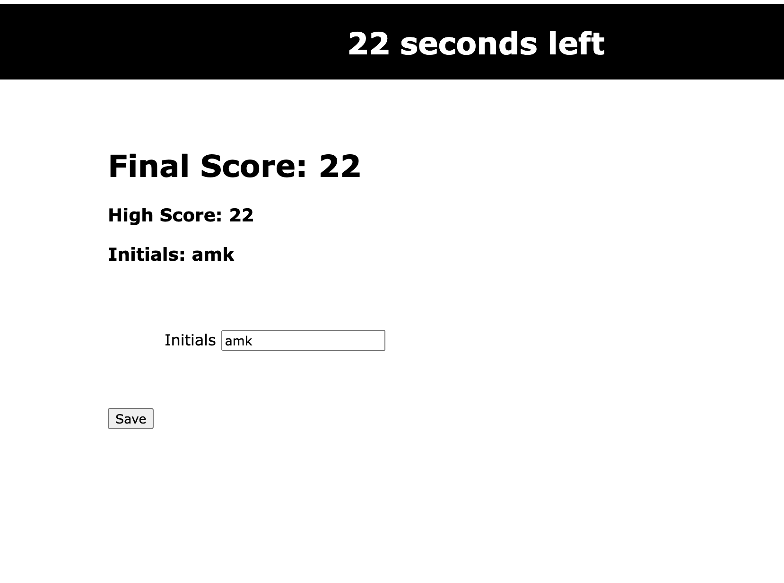

# Web APIs Code Quiz

## Objective

The objective was to create a timed quiz. The quiz uses vanilla JavaScript and web APIs to dynamically cycle through an array of objects that contain questions and potential answers. Any time an incorrect answer is selected, additional time is subtracted from the clock. Once all questions are answered OR the timer reaches 0, the quiz is over and the quiz-taker can save their answers and score in local storage. The twist here is that the final score actually equals the number of seconds left, meaning the faster the user completes the quiz, the higher their score.

## What I Learned

Working with vanilla JS and web APIs is not my idea of fun. My final result is functional, but it's not pretty. However my focus with this project was to gain a better understanding of working with web APIs, and I've definitely grown a lot through this project. 

## Production Link

Open [https://annamarlena.github.io/web-apis-code-quiz/](https://annamarlena.github.io/web-apis-code-quiz/) in your browser to take the quiz!

## Screenshot

